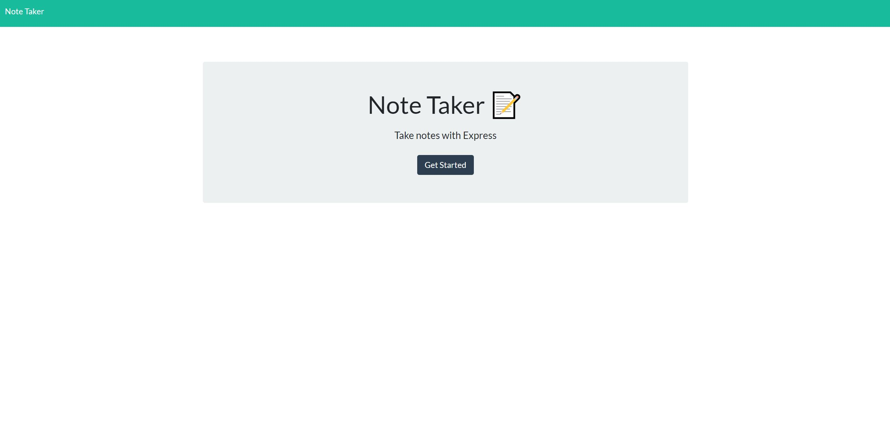
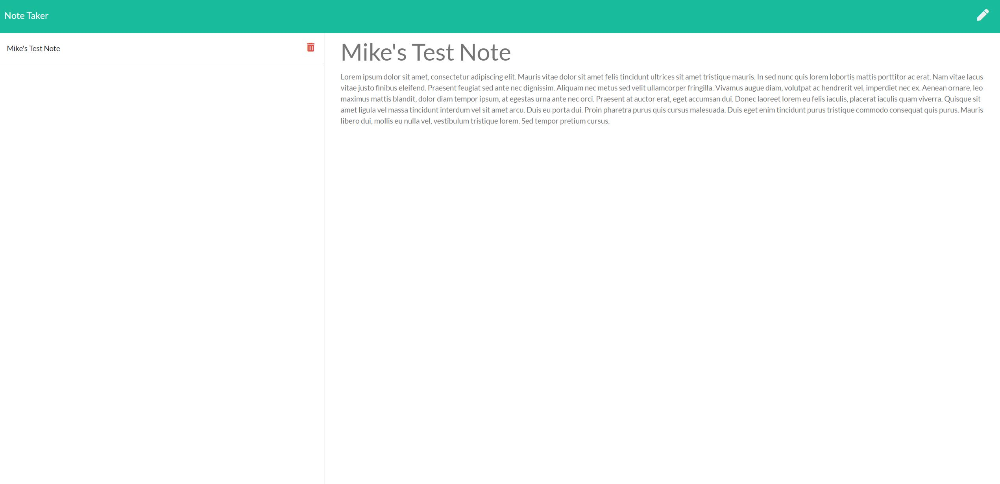

# Note-Taker

## Description
    
I created a node.js application that uses Express to create, read, and delete notes stored on a heroku server. The notes are stored for later use in a JSON object on the server. 
    
## Table of Contents
1. [Installation](#installation)
2. [Usage](#usage)
3. [License](#license)
4. [Questions](#questions)
5. [Credits](#credits)
    
## Installation
    
Go to this [deployed link](https://mike-coletta-note-taker.herokuapp.com/) to view and use the application.
    
## Usage

    
## License
    
MIT License
    
Copyright (c) 2021 Mike Coletta
          
## Questions?
    
[Github](https://github.com/MikeColetta)
    
For any questions, please send me an [email](mailto:coletta.mike@gmail.com).
